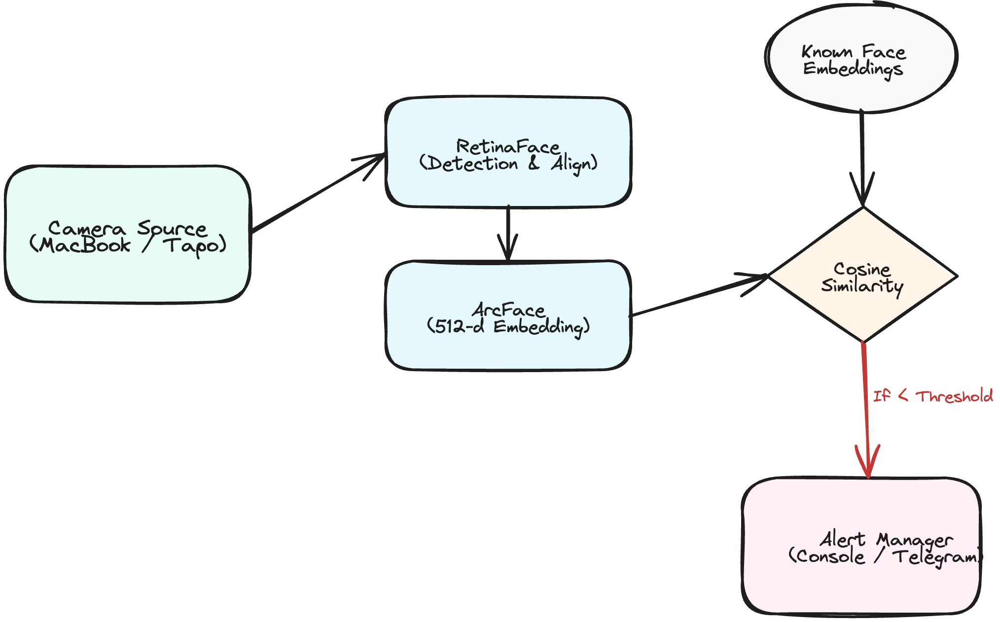

# Home Security System

Home security application that monitors video feeds, recognizes known faces, and alerts you when unknown individuals are detected.

## How It Works

The system is designed with a continuous event loop that processes data in real-time. Here is exactly what happens under the hood:

1. **Initialization & Training**: 
   When the app starts, it looks inside the `data/known_faces/` directory. It passes all reference images through the **InsightFace** neural network to generate dense **512-dimensional ArcFace embeddings** for every known person.
2. **Video Capture**: 
   The application connects to an active camera source (like your MacBook WebCam or a Tapo IP camera) and continually grabs individual image frames.
3. **Face Detection**: 
   For every frame, it uses the state-of-the-art **RetinaFace** deep learning model. It detects faces at any angle or scale and pinpoints 5 key facial landmarks (eyes, nose, mouth corners) in 3D space to align the face perfectly.
4. **Face Recognition (Identification)**:
   The aligned face is passed through the **ArcFace** network which computes its 512-number geometric vector. It then uses **Cosine Similarity** to compare this live vector against the known vectors in memory. If the similarity score is high (above ~40%), it labels the face with the person's name. Otherwise, it is labeled "Unknown".
5. **Alerting Mechanism**: 
   If an "Unknown" face is detected, the Alert Manager is triggered. To prevent notification spam, the alerting system enforces a cooldown period (e.g., 5 seconds) before sending subsequent alerts.
6. **Live Display**: 
   The frame is annotated with colored bounding boxes (🟢 Green for Known, 🔴 Red for Unknown) and displayed on your screen.

---

## Architecture & Modularity

The system abstracts the **Camera Source** and the **Alerting Mechanism**. This means you can easily swap out components without rewriting the face recognition pipeline.

<p align="center">
  
</p>

* **`src/config.py`**: Central configuration for paths, active camera, active alerts, and face detection tuning parameters.
* **`src/camera/base.py`**: Abstract base class defining how a camera should behave (`start`, `get_frame`, `stop`).
  * **`webcam.py`**: Concrete implementation for local USB/laptop webcams using OpenCV.
  * **`tapo.py`**: (Stub) Concrete implementation for IP cameras broadcasting via RTSP (like the Tapo C210).
* **`src/alerts/base.py`**: Abstract base class defining how alerts should be sent.
  * **`console.py`**: Concrete implementation that prints alerts to your terminal window.
  * **`telegram.py`**: (Stub) Concrete implementation intended to send a push notification to a Telegram group chat.
* **`src/recognition/face_ops.py`**: Encapsulates the InsightFace AI pipeline (RetinaFace for detection, ArcFace for embeddings).
* **`main.py`**: The entrypoint that ties the Camera, Recognizer, and Alerts together.
* **`add_person.py`**: A convenient utility script to quickly capture 360-degree facial profiles using your webcam and the RetinaFace AI to ensure high-quality reference embeddings.

---

## Authentication

The system includes a secure JWT-based authentication mechanism for accessing the API. Authentication credentials and settings are managed as follows:

### Environment Configuration

The system relies on a few critical environment variables. These can be set in your terminal or via a `.env` file in the project root:

```env
# Required for JWT authentication signing
SECRET_KEY="your-super-secret-key"

# Required for Telegram Alerts (Optional)
TELEGRAM_BOT_TOKEN="123456789:ABCdefg..."
TELEGRAM_CHAT_ID="-100123456789"
```

This key must be set before running the application.

### Password Management

Before starting the application, you must create the credentials file and set your password.

⚠️ **Required**: Run the password script before starting the application:
```bash
uv run scripts/set_password.py
```

The script validates password strength (minimum 8 characters, with uppercase, lowercase, and digits).

### Default Credentials

If you forget your password, you can manually edit `data/credentials.json` and update the `hashed_password` field with a new bcrypt hash, or delete the file and run the set_password script to create new credentials.

---

## Setup & Installation

This project uses `uv` for fast, reproducible Python environment management.

### Prerequisites
- Python 3.10+
- `uv` installed
- A functioning webcam (for testing)

### Installation Steps

1. **Clone/Navigate to the repository**
   ```bash
   cd /path/to/home-security
   ```

2. **Sync the environment**
   This will automatically create a virtual environment (`.venv`) and install all dependencies.
   ```bash
   uv sync
   ```

---

## Operating the Application

### 1. Register Known Faces
For the system to recognize you or your family, you need to provide reference images.

The easiest way to do this is using the built-in capture utility:

1. Run the `add_person.py` script:
   ```bash
   uv run add_person.py
   ```
2. Enter the person's name when prompted.
3. Look at the camera and press the `c` key to take 3-5 photos from slightly different angles.
4. Press `q` to quit and save.

The script automatically creates the necessary folder structure under `data/known_faces/` and saves the images. The next time you run `main.py`, the system will automatically train itself on these new faces.

*(Alternatively, you can manually create a folder named after the person in `data/known_faces/` and place clear, front-facing `.jpg` or `.png` images inside).*

*Example Directory Structure:*
```text
home-security/
└── data/
    └── known_faces/
        ├── joynal/
        │   ├── face1.jpg
        │   └── face2.jpg
        └── alice/
            └── profile.png
```

### 2. Run the System
Activate the script via `uv` which will handle the virtual environment execution automatically:

```bash
uv run main.py
```

### 3. Usage & Troubleshooting
* **Permissions on macOS**: The first time you run this, macOS will explicitly ask if "Terminal" (or iTerm) can access your Camera. You **must** click "Allow". If you accidentally deny it, go to *System Settings > Privacy & Security > Camera* and enable it for your terminal application.
* **Exiting**: Ensure the visual camera window is active/focused, and **press the `q` key** on your keyboard to safely stop the camera and close the application. Do not just `Ctrl+C` in the terminal if you can avoid it, to ensure the webcam hardware releases properly.

---

## Future Extensions

When you are ready to transition from a MacBook testing environment to a real home security setup:

1. **Enable Tapo C210 Camera**:
   * Open the Tapo App on your phone.
   * Go to your Camera Settings > Advanced Settings > Camera Account and set a username/password.
   * Modify `main.py` to instantiate `TapoCamera(username="...", password="...", ip_address="...")`.
   * Change `ACTIVE_CAMERA = "tapo"` in `src/config.py`.
### 2. Enable Telegram Alerts (Implemented)
   The system can instantly send a JPEG snapshot to a Telegram group chat when an unknown face is detected (throttled to 1 alert per 30 seconds per camera).
   * Open Telegram and message `@BotFather` to create a Bot and get your `TELEGRAM_BOT_TOKEN`.
   * Add the bot to your Family Group and use `https://api.telegram.org/bot<TOKEN>/getUpdates` to find the `TELEGRAM_CHAT_ID` (usually starts with `-100`).
   * Add both of these to your `.env` file.
   * Open `src/config.py` and change line 33 to read: `ACTIVE_ALERT = "telegram"`.
